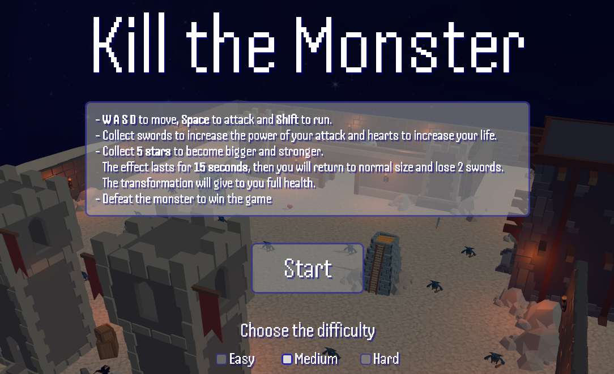

# Kill the Monster

<p align="center">

</p>

This game has been developed in ```three.js``` as final project of the exam Interactive Graphics.

https://valeriospagnoli.github.io/Interactive-Graphics-Project/


<button style="background-color: blue; color: white; padding: 10px; border: none; border-radius: 5px;" 
onmouseover="this.style.backgroundColor='green';" 
onmouseout="this.style.backgroundColor='blue';">
  Hover over me!
</button>

## Description
You play as a knight, tasked with defeating a powerful monster. In your normal state, you're too weak to win. However, by collecting swords, you can boost your strength. Gather 5 stars to temporarily transform into a larger, more powerful knight, but the transformation lasts only 15 seconds. You can also collect hearts to restore your health.

## How to play
Only the keyboard is needed:
- **W A S D** to move,
- **Space** to attack,
- **Shift** to run.